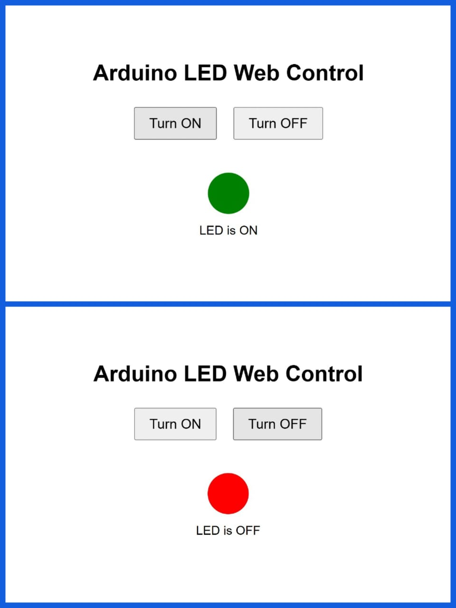

# Low Level Device Driver (Arduino LED Control)

This project simulates a low-level device driver using Node.js and Arduino UNO.

## 🔧 Features
- Control onboard Arduino LED via web interface
- API abstraction using `/on` and `/off`
- Real-time LED status with colored indicator
- Full hardware-software integration

## 📁 Tech Stack
- Node.js + Express
- SerialPort library for hardware I/O
- HTML, CSS, JS frontend
- Arduino UNO (connected on COM11)

## ⚙️ How to Run

1. Connect Arduino UNO to your PC (COM11 or adjust as needed).
2. Upload this Arduino sketch:
    ```cpp
    void setup() {
      pinMode(13, OUTPUT);
      Serial.begin(9600);
    }

    void loop() {
      if (Serial.available()) {
        char data = Serial.read();
        digitalWrite(13, data == '1' ? HIGH : LOW);
      }
    }
    ```
3. Install dependencies and start server:
    ```bash
    npm install express serialport
    node server.js
    ```
4. Open browser at [http://localhost:3000](http://localhost:3000)

## 📸 Demo



## 🧠 Learning Focus
- Device Driver Abstraction
- Serial Communication (I/O)
- Real-time Web Control of Hardware

## 📌 Author
[Gokul Raktate](https://github.com/gokulraktate)
